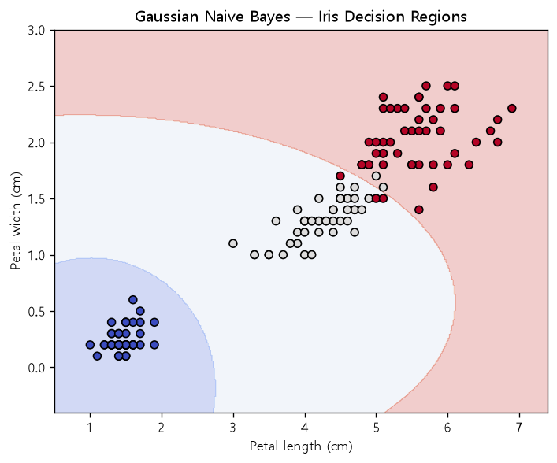

# NLP 기초 (NLP Foundations)
### Naive Bayes 텍스트 분류 · 워드 임베딩 · SimpleRNN

> **English summary**
> A hands-on collection of NLP fundamentals: **Naive Bayes** text classification (Bernoulli NB for spam-mail detection, Multinomial NB for IMDB movie-review sentiment, and a Gaussian NB example on Iris), word-embedding concepts, and a **SimpleRNN** sequence model (numeric next-value regression and IMDB sentiment classification with Embedding + SimpleRNN). This repo is the conceptual groundwork for the deep-learning sequence models used in the sibling `korean-movie-review-sentiment` project.


---

## 개요 / 문제 정의

자연어 처리의 두 축 — **확률 기반 고전 분류(Naive Bayes)** 와 **신경망 기반 시퀀스 모델(RNN)** — 을 최소 예제로 직접 구현하며 감을 잡는 학습용 저장소입니다.

- 텍스트를 수치 벡터로 바꾸는 방법 (`CountVectorizer`, 정수 인코딩, 임베딩)
- 조건부 확률로 분류하는 Naive Bayes 계열(Bernoulli / Multinomial / Gaussian)의 차이
- 순서 정보를 다루는 SimpleRNN의 구조와 임베딩 결합

## 데이터셋

| 스크립트 | 데이터 | 규모/특징 |
|----------|--------|-----------|
| 스팸 분류 | 인라인 이메일 제목 6건 (`spam` True/False) | 초소형 토이 데이터, Bernoulli 이진 특성 |
| Iris 예제 | `sklearn.datasets.load_iris` | 3-class, 연속형 특징 (Gaussian NB 시각화) |
| 영화 리뷰 | `IMDB Dataset.csv` | 영어 리뷰, `positive/negative` 라벨 |
| SimpleRNN 회귀 | 인라인 정수 시퀀스 4건 | 다음 값 예측 (regression) |
| IMDB RNN | `keras.datasets.imdb` (`num_words=500`) | 25,000 train / 25,000 test, 이진 감성 |

## 방법론

### 1. Naive Bayes 텍스트 분류

- **베르누이 NB (스팸)** — `베르누이_나이브베이즈_스팸메일분류.py`
 `CountVectorizer(binary=True)`로 단어의 **존재 여부(0/1)** 만 특성화 → `BernoulliNB.fit` → `score`
- **다항 NB (영화 리뷰)** — `영화_리뷰_나이브베이즈분류.py`
 정규식 `[^a-zA-z\s]`로 정제 → `sentiment` 라벨 매핑(positive=1) → `CountVectorizer`(단어 빈도) → `MultinomialNB.fit`
- **가우시안 NB 예제** — `나이브베이즈_분류_예제1.py`
 Iris 데이터 로드 → 클래스별 `sepal length` 분포를 `seaborn.histplot`으로 시각화(`iris_histplot.jpeg` 저장). 연속형 특징에 GaussianNB가 적합한 이유를 분포로 확인

### 2. SimpleRNN

- **정수 시퀀스 회귀** — `SimpleRNN_모델분석.py`
  ```
  SimpleRNN(10, return_sequences=False, input_shape=(3,1))
  Dense(1)                        # loss='mse', optimizer='adam'
  ```
 `[[5,6,7],[1,2,3],...] → 다음 값` 예측으로 RNN의 입력 shape·출력 흐름을 최소 단위로 학습

- **IMDB 감성 분류** — `imdb_simplernn_모델설계.py`
  ```
  Input(shape=(100,))
  Embedding(input_dim=500, output_dim=16, input_length=100)
  SimpleRNN(8)
  Dense(1, activation='sigmoid')
  ```
 `imdb.load_data(num_words=500)` → `train_test_split`(8:2) → `pad_sequences(maxlen=100)` → 임베딩+RNN 이진 분류. 주석에는 정수 시퀀스를 단어로 역디코딩(`get_word_index`)하는 방법도 정리

### 3. 워드 임베딩
- `word_embedding.py` — 임베딩 개념 학습용 슬롯 (현재 비어 있는 placeholder). 임베딩의 실제 적용은 위 `imdb_simplernn_모델설계.py`의 `Embedding` 레이어와 자매 저장소 `korean-movie-review-sentiment`에서 확인 가능

> 참고: `베르누이나이브베이즈_예제2.py`, `word_embedding.py` 는 현재 빈 파일(placeholder)입니다.

## 결과

저장소 코드로 재현한 실제 시각화입니다. (`results/`)



Gaussian Naive Bayes가 Iris의 꽃잎 길이·너비 두 특성만으로 세 품종의 결정 영역을 확률적으로 분할하는 모습입니다. 각 클래스를 정규분포로 가정하는 나이브베이즈의 특성상 부드러운 곡선 경계가 형성됩니다.

- 그 외: Naive Bayes 스크립트는 `score()` / `accuracy_score`로 학습 정확도를, SimpleRNN 스크립트는 `fit` 과정의 `loss`(mse / binary_crossentropy) 추이를 출력합니다.

> 구체적 정확도 수치는 실행 환경·데이터에 따라 달라지므로 명시하지 않습니다. 위 그림은 `results/` 생성 코드(scikit-learn + matplotlib)의 실제 출력입니다.

## 실행 방법

```bash
pip install -r requirements.txt

# Naive Bayes
python src/베르누이_나이브베이즈_스팸메일분류.py
python src/영화_리뷰_나이브베이즈분류.py     # IMDB Dataset.csv 경로 필요
python src/나이브베이즈_분류_예제1.py         # matplotlib/seaborn 시각화

# SimpleRNN
python src/SimpleRNN_모델분석.py
python src/imdb_simplernn_모델설계.py         # keras가 IMDB 데이터 자동 다운로드
```

> `영화_리뷰_나이브베이즈분류.py`의 CSV 경로는 개발 환경 절대 경로(`/home/sckit/...`)이니 로컬 경로로 수정하세요.

## 배운 점

- **벡터화 방식이 모델을 결정한다**: 존재 여부(0/1) → Bernoulli, 빈도 → Multinomial, 연속형 → Gaussian. 데이터 특성에 맞는 NB 변형을 고르는 감각을 익혔습니다.
- **고전 vs 신경망**: Naive Bayes는 빠르고 해석이 쉽지만 단어 순서를 무시합니다. RNN은 `pad_sequences`로 시퀀스를 정렬하고 임베딩으로 의미를 학습해 순서 정보를 반영합니다.
- **임베딩의 역할**: 원-핫 대신 저차원 밀집 벡터(`output_dim=16`)로 단어를 표현해 파라미터를 줄이고 유사도를 학습하는 원리를 이해했습니다.

## 참고

- [`korean-movie-review-sentiment`](https://github.com/NvidiaSeoul/korean-movie-review-sentiment) — 여기서 다진 임베딩·시퀀스 개념을 **LSTM + 한국어 형태소 분석**으로 확장한 심화 프로젝트
- [`deep-learning-keras`](https://github.com/NvidiaSeoul) — Keras 모델 설계 기초

---

> NVIDIA AI Academy Seoul · Cohort 1 포트폴리오의 일부 — [전체 보기](https://github.com/NvidiaSeoul)
